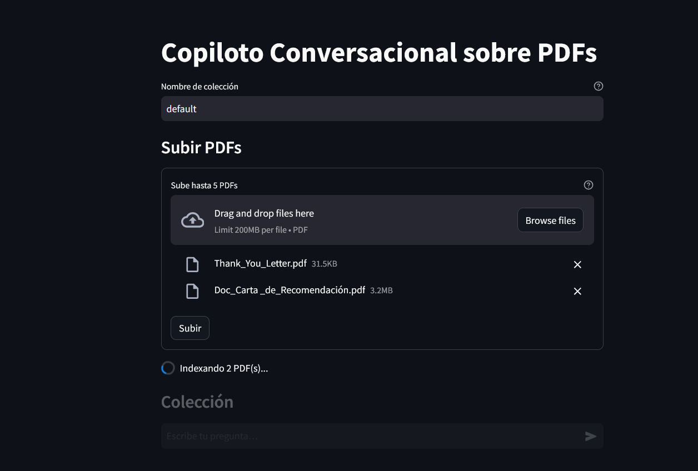
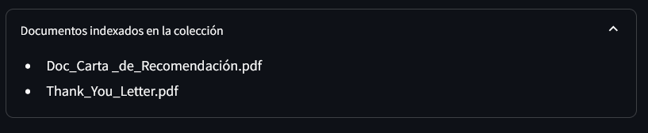
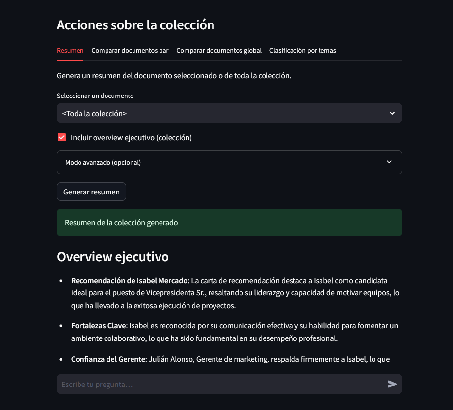
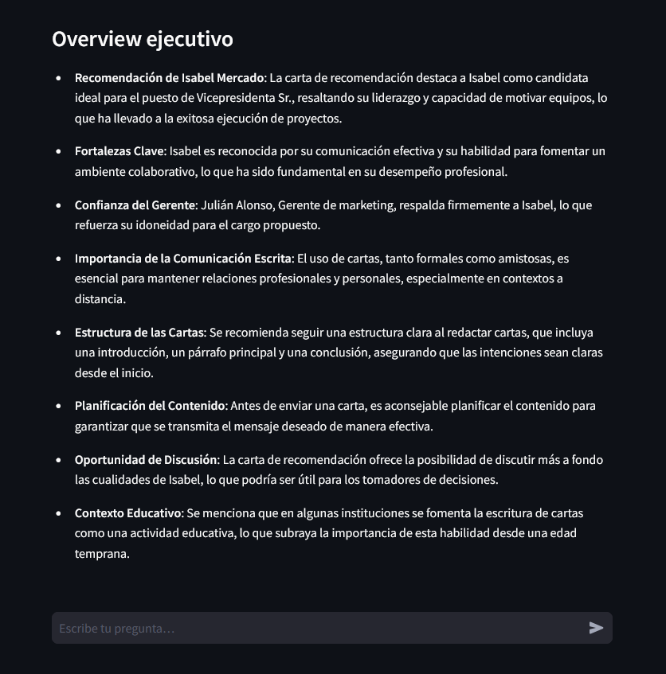
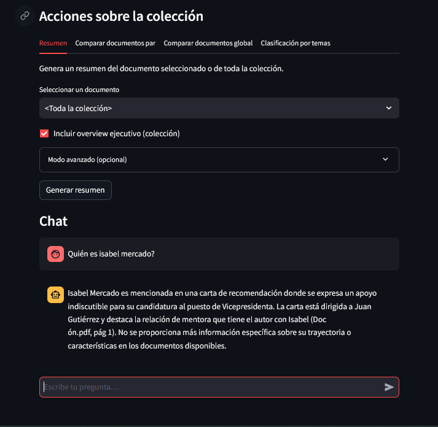
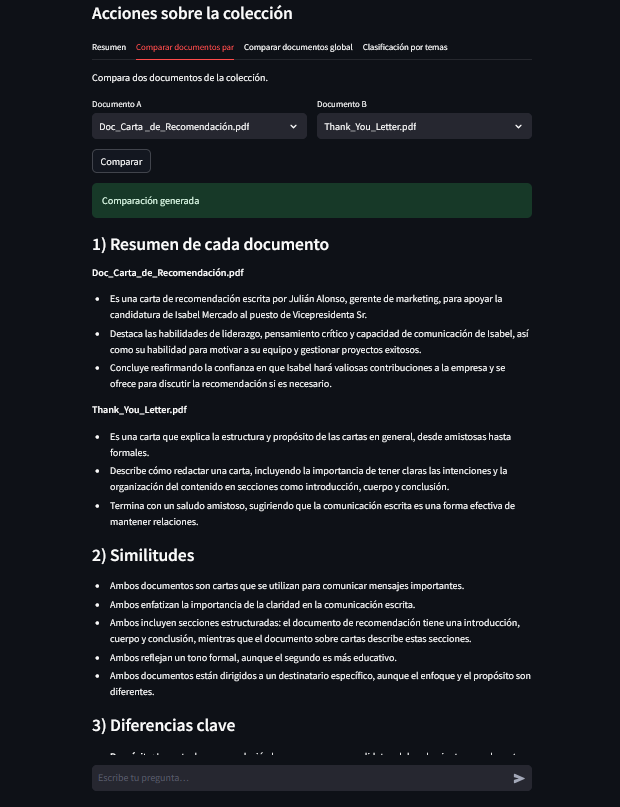
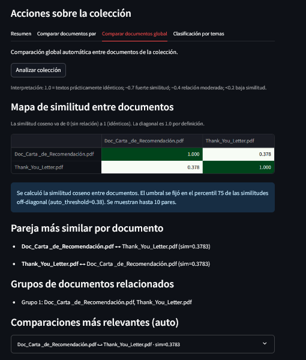
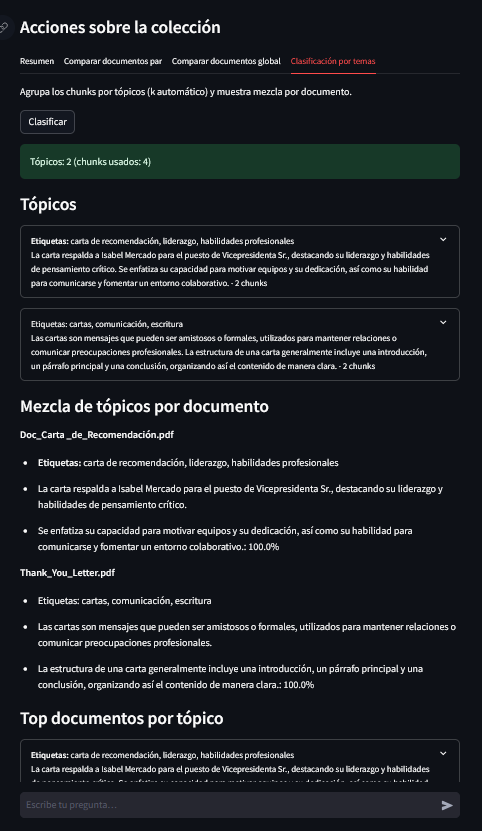

# 📑 Copiloto Conversacional sobre PDFs

## 1. Descripción general

Este proyecto implementa un **copiloto conversacional** que permite al usuario **subir hasta 5 documentos PDF** y realizar consultas en lenguaje natural.  
El sistema responde con **citas precisas y contextualizadas**, y soporta además:

- ✅ **Resúmenes automáticos** (por documento o colección).
- ✅ **Comparaciones** (doc–doc y global con matriz de similitud).
- ✅ **Clasificación por temas/tópicos** (con mezcla por documento).

Diseñado como un **MVP robusto** para el desafío de CatchAI, con foco en **claridad, transparencia y escalabilidad futura**.

---

## 2. Arquitectura del sistema

### 2.1 Componentes principales

- **Frontend** → [Streamlit](https://streamlit.io/)
- **Backend** → [FastAPI](https://fastapi.tiangolo.com/) + Uvicorn
- **Orquestador propio** → aplica _guardrails_:
  - cobertura mínima,
  - mean_top score,
  - diversidad de fuentes en comparaciones,
  - abstención controlada,
  - forzado de citas.
- **Vector Store** → [ChromaDB](https://www.trychroma.com/), persistente en disco.
- **LLM** → [OpenAI](https://platform.openai.com/) (embeddings + chat).  
  _(Tests pueden usar `FAKE_LLM=1` para aislar dependencias)._

### 2.2 Flujo conversacional

1. **Ingesta** (`/ingest`): procesa PDFs → extracción página a página → chunking → embeddings → almacenamiento en Chroma.
2. **Chat** (`/chat`):
   - Detecta intención (respuesta, resumen, comparación, clasificación).
   - Construye plan de recuperación con umbrales y top-k.
   - Recupera evidencias (semántico + keyword boost).
   - Re-rank (hook listo para cross-encoder).
   - Aplica **guardrails** y cita obligatoria.
   - LLM sintetiza la respuesta final.

---
 
### 2.3 Estructura del proyecto

```bash
doc-copilot/
├── .github/workflows/       # CI/CD con GitHub Actions (pytest en cada push/PR)
│   ├── build.yml
│   └── ci.yml
├── backend/                 # API en FastAPI
│   ├── __init__.py
│   ├── main.py              # Endpoints principales (chat, ingest, summary, compare...)
│   ├── _core/               # Lógica interna (guardrails, orquestador, utils)
│   ├── Dockerfile
│   └── requirements.txt
├── frontend/                # Interfaz en Streamlit
│   ├── app.py               # UI principal con tabs (resumen, comparación, clasificación)
│   ├── Dockerfile
│   └── requirements.txt
├── data/                    # Persistencia local de ChromaDB
│   └── chroma/
├── docs_img/                # Capturas usadas en README
│   ├── resumen_coleccion_1.png
│   ├── comparacion_global_documentos.png
│   └── ...
├── samples/                 # PDFs de ejemplo para pruebas rápidas
│   ├── Doc_Carta_de_Recomendación.pdf
│   └── Thank_You_Letter.pdf
├── tests/                   # Tests unitarios y de guardrails (pytest)
│   ├── conftest.py
│   ├── test_chat_endpoint_happy.py
│   ├── test_compare_requires_diversity.py
│   └── ...
├── docker-compose.yml       # Orquestación de frontend + backend
├── requirements.txt         # Dependencias globales
├── .env.example             # Variables de entorno de ejemplo
└── README.md
```

---

## 3. Cómo ejecutar

### 3.1 Clonar repo

```bash
git clone https://github.com/alesobDPL/doc-copilot.git
cd doc-copilot
```

### 3.2 Configurar variables

Copia y edita `.env`:

```bash
cp .env.example .env
```

Configura al menos:

```env
OPENAI_API_KEY=sk-xxxxx
VSTORE_BACKEND=chroma
```

---

### 🚀 Opción A – Ejecutar con Docker (recomendado)

Requiere [Docker](https://www.docker.com/) y [docker-compose](https://docs.docker.com/compose/).

```bash
docker compose up --build
```

- **Frontend** → [http://localhost:8501](http://localhost:8501)
- **Backend** → [http://localhost:8000/docs](http://localhost:8000/docs)

Logs útiles:

```bash
docker compose logs -f backend
docker compose logs -f frontend
```

Apagar y limpiar:

```bash
docker compose down -v
```

---

### 🛠️ Opción B – Ejecutar en local con Python

Requiere **Python 3.11+** y [pip](https://pip.pypa.io/).

1. Crear entorno virtual (opcional pero recomendado):

   ```bash
   python -m venv .venv
   source .venv/bin/activate   # Linux/macOS
   .venv\Scripts\activate      # Windows PowerShell
   ```

2. Instalar dependencias:

   ```bash
   pip install -r backend/requirements.txt
   pip install -r frontend/requirements.txt
   ```

3. Levantar backend:

   ```bash
   uvicorn backend.main:app --reload --port 8000
   ```

4. Levantar frontend:

   ```bash
   streamlit run frontend/app.py
   ```

---

## 4. Pruebas y validación

### 4.1 Unit & guardrails

```bash
pytest -q
```

- Abstención cuando no hay evidencia.
- Forzado de citas.
- Orquestador con planes estrictos.

### 4.2 Smoke test manual

1. Subir `Doc_Carta_de_Recomendación.pdf` y `Thank_You_Letter.pdf`.
2. Preguntar: _¿Quién es Isabel Mercado?_ → Respuesta con citas explícitas.
3. Pestaña **Resumen** → obtener resumen con bullets.
4. **Comparar global** → matriz de similitudes + grupos.
5. **Clasificar** → tópicos detectados y mezcla de docs.

---

## 5. Debugging

- **Frontend** → expander de debug con evidencias.
- **Backend** → endpoint de recuperación manual:

```bash
curl -X POST localhost:8000/debug/retrieval \
  -H "Content-Type: application/json" \
  -d '{"collection":"default","question":"Isabel Mercado","k":8}'
```

- Si Chroma “pierde” datos: revisar volumen `doc_data`.

---

## 6. CI/CD (opcional)

Este repo incluye un workflow de CI que ejecuta tests con pytest en cada push/PR (sin usar claves reales gracias a FAKE_LLM=1).

Archivo `.github/workflows/ci.yml` incluido.
Ejecución automática de pytest en cada push/PR con `FAKE_LLM=1`.

El CD (despliegue automático) no está activado aún; se deja un workflow base para construir y publicar imágenes cuando se configuren secrets y un registro de contenedores.

---

## 7. Cheat sheet

```bash
docker compose up --build       # levantar todo
docker compose logs -f backend  # logs backend
docker compose run --rm backend pytest -q
docker compose down -v          # limpiar volúmenes
```

---

## 8. Justificación técnica

- **ChromaDB**: simple, portable y persistente. Ideal para demo.
- **Orquestador propio**: control estricto de citas y abstención → confiabilidad.
- **Streamlit**: rápido de prototipar y mostrar.
- **FastAPI**: rendimiento + docs auto.
- **Docker**: portabilidad total.
- **Pytest**: asegura reproducibilidad de tests.

---

## 9. Limitaciones y roadmap

### 9.1 Limitaciones actuales

- ❌ No OCR para PDFs escaneados.
- ❌ Sin autenticación/roles.
- ❌ Reranker/cross-encoder aún no implementado.
- ❌ Frontend básico en Streamlit.
- ❌ No hay despliegue productivo con Nginx/TLS.

### 9.2 🔮 Posibles mejoras futuras

- [ ] OCR con Tesseract para PDFs escaneados.
- [ ] Reranker con cross-encoder (ej. bge-reranker).
- [ ] Autenticación JWT + roles.
- [ ] WebApp más completa en React/Next.js (mejor UX).
- [ ] Panel de administración de colecciones.
- [ ] Exportar/importar colecciones.
- [ ] Integración con S3/GCS para almacenamiento en la nube.
- [ ] Modo oscuro y personalización visual.
- [ ] Notificaciones/recordatorios ligados a documentos.
- [ ] CI/CD con despliegue automático en AWS/GCP/Azure.

---

## 10. Capturas esperadas











---

## 11. Créditos

Proyecto desarrollado como **desafío técnico para CatchAI**.
Integra todo el stack RAG moderno con énfasis en **control, transparencia y robustez**.
